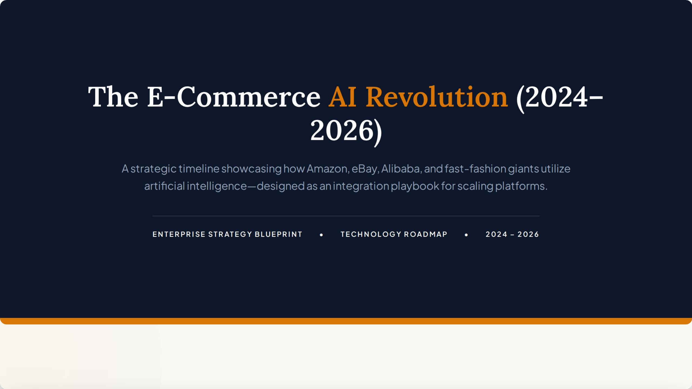

# Costco AI Commerce Timeline (2024-2026)

## Overview

This project presents a forward-looking timeline for how Costco can respond to the rapid adoption of artificial intelligence in e-commerce between 2024 and 2026. Amazon serves as the primary competitive benchmark because its Rufus shopping assistant and COSMO semantic discovery system demonstrate how AI can reshape product search, recommendation, and customer intent recognition at scale.

The timeline also draws supporting lessons from eBay, Temu, Shein, and Alibaba. Together, these platform examples show a broader transition from AI-assisted discovery to algorithmic supply chains and, ultimately, agentic commerce. The goal is to translate that market evolution into practical priorities for Costco rather than simply catalogue a set of presentation slides.

## Strategic Question

How can Costco preserve the strengths of its membership model while closing the AI-commerce capability gap with Amazon?

Costco's competitive advantage is built on member trust, value, a curated assortment, and high-volume purchasing. Amazon's digital advantage comes from deep behavioral data, personalized discovery, and a highly developed AI interface. The opportunity for Costco is not to copy Amazon's endless-aisle model, but to apply AI in ways that make its focused assortment easier to discover, its member experience more relevant, and its supply chain more responsive.

## Timeline

### 2024 — Semantic Discovery and Smart Commerce Foundations

Amazon's Rufus and COSMO illustrate the shift from keyword search toward intent-aware shopping. Customers can ask conversational questions, compare products, and receive recommendations shaped by context rather than exact search terms. eBay's AI-assisted “Magical Listings” similarly reduces seller friction by generating structured listing content from limited inputs.

**Implication for Costco:** Build a member-centered discovery layer that can understand missions such as stocking a household, planning an event, or finding the best value for a family. Costco can combine conversational search with its smaller, curated product catalogue to provide clearer and more trustworthy recommendations.

### 2025 — Algorithmic Supply Chains

Temu and Shein demonstrate how customer signals can be connected directly to sourcing, inventory, and production decisions. Their Customer-to-Manufacturer approaches use demand feedback and smaller test batches to reduce overproduction and react quickly to changing preferences.

**Implication for Costco:** Connect digital behavior, warehouse demand, membership patterns, and regional purchasing signals more closely to forecasting and replenishment. AI should support buyers and operators by identifying demand shifts early while preserving human oversight and Costco's disciplined merchandising model.

### 2026 — Agentic Commerce and Virtual Experiences

The next stage moves beyond isolated recommendations toward persistent shopping agents. These systems can remember preferences, coordinate multi-step purchases, support virtual product experiences, and synchronize customer journeys across regions and channels. Alibaba's virtual try-on and cross-border commerce capabilities illustrate how these interfaces may become more immersive and localized.

**Implication for Costco:** Develop an opt-in member assistant that can remember household preferences, assemble repeat purchases, recommend coordinated bundles, and connect online planning with warehouse fulfillment. Strong consent, privacy controls, and transparent recommendations should distinguish Costco's approach.

## Costco and Amazon: Strategic Comparison

| Dimension | Amazon benchmark | Opportunity for Costco |
| --- | --- | --- |
| Customer relationship | Broad customer reach and extensive behavioral data | Trusted paid membership with high-quality household purchasing signals |
| Product discovery | Conversational, personalized, and intent-aware | Guided discovery across a curated assortment with value-focused explanations |
| Assortment model | Very large marketplace and long-tail selection | Limited, high-confidence selection that can reduce decision fatigue |
| Supply chain AI | Large-scale forecasting, fulfillment, and recommendation feedback loops | Member- and warehouse-informed forecasting with buyer oversight |
| AI interface | Rufus and other embedded shopping experiences | A privacy-conscious Costco member assistant across digital and warehouse journeys |
| Strategic objective | Maximize convenience, selection, and transaction frequency | Strengthen member value, renewal, trust, and operational efficiency |

## Recommended Priorities for Costco

1. Launch intent-based discovery for high-value member shopping missions rather than relying only on keyword indexing.
2. Create rapid feedback loops between digital interactions, warehouse demand, buyers, and inventory teams.
3. Use AI to improve product onboarding, catalogue metadata, and comparison content.
4. Introduce an opt-in member memory layer with clear privacy and consent controls.
5. Pilot coordinated AI agents for discovery, replenishment, and fulfillment while keeping people accountable for consequential decisions.

## View the Full Timeline

[Open the seven-page PDF presentation](docs/The%20E-Commerce%20AI%20Revolution%20%282024-2026%29.pdf)

The presentation includes the 2024-2026 timeline, a platform AI deployment matrix, and a retailer playbook derived from the comparison.

## Background Resources

- Putchuon - Put You On. [The Entire History of Artificial Intelligence (Last 100 Years)](https://www.youtube.com/watch?v=mSd9nmPM7Vg). YouTube, May 30, 2024.
- IEEE Computer Society. [The Evolution of AI: From Foundations to Future Prospects](https://www.computer.org/publications/tech-news/research/evolution-of-ai).
- Our World in Data. [A Brief History of Artificial Intelligence](https://ourworldindata.org/brief-history-of-ai).

## Authors

- Zihuan Wang
- Xiaodi Yang

## Rights

Copyright © 2026 Zihuan Wang and Xiaodi Yang. This repository is shared for portfolio and educational viewing. All third-party names, trademarks, and referenced imagery remain the property of their respective owners.
